# Air Routing Graph — Construction Logic

**Status:** draft, design doc (Session 14, 2026-05-22). **Not** an approved formulation.
**Purpose:** specify how the air routing MILP's graph is constructed — node types, arc
types, the MAWB / consolidation-group logic, the construction steps, and a validated
case catalogue. This is the doc the user validates graph-creation logic against. Kept
separate from `air_freight_routing.tex` (the model was getting too complex to hold
both). Supersedes and absorbs `mawb_routing_cases.md`.

Diagrams: graph/path examples — **nodes = airports/gateways/CFS**, **edges = arcs** —
in Mermaid. Carrier codes are real (CI China Airlines, BR EVA, CX Cathay, CV Cargolux,
KE Korean, DL Delta). HAWB = one shipper's shipment; MAWB = one carriage contract.

---

## 1. The model in one paragraph

The air MILP routes shipments on an **O-D-arc graph**. A shipment's journey is a path
of arcs. The central object is the **MAWB = (MAWB-arc, consolidation group `g`)**:
HAWBs consolidate by sharing a MAWB-arc within the same group. Physical flight legs
sit *beneath* a MAWB-arc as metadata (for transit time and per-flight capacity); they
are not the routing graph. This is the resolution of the earlier "bucket per
flight-leg" formulation, which was wrong — a MAWB is a carriage contract over an O-D
*segment*, not a leg.

---

## 2. Node types

| Node | Symbol | Description |
|---|---|---|
| Origin door | `O` | Shipper premises — where the shipment originates. |
| Origin CFS | `CFS-O` | Consolidation warehouse at/near the origin gateway. May be **off-airport** (forwarder's own warehouse) or **on-airport** (airport-operated CFS — e.g.\ HKG SuperTerminal / Hactl, FRA Cargo City). Both modeled identically; the cartage-arc time/cost (§3) captures the difference. |
| Origin gateway airport | `POL` | Airport of departure. |
| Hub airport | `H` | Intermediate airport — connection / transfer point. |
| Hub CFS | `CFS-H` | Consolidation warehouse at a hub — where the forwarder breaks a MAWB (deconsolidates) and re-consolidates. **Present only at hubs the forwarder (or its agent) operates a warehouse.** May be off-airport or on-airport (same modeling). Hubs without `CFS-H` allow carrier-side connections only. |
| Destination gateway airport | `POD` | Airport of arrival. |
| Destination CFS | `CFS-D` | Deconsolidation warehouse at/near the destination gateway. Off-airport or on-airport (same modeling). Customs clearance dwell (§3) is located between here and final delivery. |
| Destination door | `D` | Consignee premises. |

A multi-carrier interline routing may pass through airports of the *carriers'* own
routing (intermediate stops) — those do **not** appear as graph nodes; they are
internal to a MAWB-arc (see §3).

---

## 3. Arc types

| Arc | Carries a MAWB? | Cost basis | Notes |
|---|---|---|---|
| **Pickup arc** (`O → CFS-O`) | no | per-shipment ground/truck cost | road leg. |
| **Origin CFS arc** (`CFS-O` dwell) | no | handling cost | consolidation build-up; dwell time. |
| **Origin cartage arc** (`CFS-O → POL`) | no | per-shipment ground/truck cost | truck or terminal handoff CFS-to-airport. Near-zero time/cost if `CFS-O` is on-airport. |
| **MAWB-arc** (`POL → POD`, or `POL → H`, or `H → POD`) | **yes** | rate on the consolidated MAWB chargeable weight (per rate family) | the forwarder-consolidated air carriage of one O-D segment. Realized beneath by ≥1 physical flight (metadata). |
| **Co-load arc** (air O-D segment) | **no** | per-kg, on each shipment's own chargeable weight | the forwarder buys space from a co-loader who consolidates; the forwarder does not model the MAWB. |
| **Deconsolidation-dwell arc** (at `CFS-H`) | no | handling cost | the break-and-rebuild between two MAWBs; carries the deconsolidation + re-consolidation dwell time. |
| **Destination cartage arc** (`POD → CFS-D`) | no | per-shipment ground/truck cost | truck or terminal handoff airport-to-CFS. Near-zero time/cost if `CFS-D` is on-airport. |
| **Destination CFS arc** (`CFS-D` dwell) | no | handling cost | deconsolidation; dwell time. |
| **Customs clearance dwell arc** (between `CFS-D` and final delivery) | no | per-HAWB clearance fees (if modelled) | carries the per-HAWB import-clearance dwell `δ_cust_k`. Per-HAWB (not per-MAWB / per-group) — each HAWB has its own import entry. Export-side filing folds into the POL effective cutoff. Probabilistic exam-hold uncertainty is deferred (§8). |
| **Final delivery arc** (`CFS-D → D`) | no | per-shipment ground/truck cost | road leg. |
| **Fallback arc** (`O → D`) | no | `C^fallback` (tenant-global constant, ~$1M) | per-HAWB direct origin-to-destination arc emitted always. Bypasses pre-filter, capacity, cutoff, MAWB linkage. Arrival time `T_k^abs` (mandatory-finite for every HAWB). Selected only when no real route exists; selection signals a structured rescue event, not an actual route. See §10. |

**MAWB-arc — internal structure.** A MAWB-arc covers a contiguous O-D segment under
*one offer*. Its physical realization (the flight legs) is arc metadata:
- a **direct** MAWB-arc = 1 flight;
- a **multi-stop / same-carrier-connection** MAWB-arc = 2+ flights of one carrier;
- an **interline** MAWB-arc = flights of 2+ carriers under one AWB (Cargo SPA / MITA).
Per-flight capacity (P.2–P.7) couples *all* MAWB-arcs whose realization includes a
given physical flight. Transit time is the sum over the arc's legs + internal MCT.

---

## 4. The MAWB and the consolidation group

### 4.1 MAWB = (MAWB-arc, group)

A MAWB is **one carriage contract**. In the graph it is identified by
**`(MAWB-arc, consolidation group g)`** — one MAWB per (arc, group). The HAWBs
assigned to a MAWB-arc partition into MAWBs by their group. The index is concrete
(an enumerable arc × an enumerable group) → **no symmetry, no MAWB-count decision**.

A new MAWB begins wherever the offer/contract changes, a carrier changes without
interline, the forwarder deconsolidates, or co-consolidated HAWBs diverge.

### 4.2 The consolidation group `g(k)`

Two HAWBs may share a MAWB only if they are on the same MAWB-arc **and**
`g(k₁) = g(k₂)`. `g(k)` is a **deterministic, single-valued function** of a fixed
tuple of HAWB attributes:

```
g(k) = ( cargo_class(k), screening_status(k), temperature_regime(k) )       [consolidable]
g(k) = ( cargo_class(k), HAWB-id(k) )                                       [non-consolidable]
```

MVP attribute domains:

**`cargo_class`** — IATA cargo categories / special-handling codes:

| Code | Name | What it is | Consolidable? |
|---|---|---|---|
| `GEN` | General cargo | Ordinary cargo, no special handling | yes — all `GEN` together |
| `PER` | Perishables | Goods that deteriorate / need temperature control — produce, flowers, seafood, some pharma | yes — with `PER` of the *same* `temperature_regime` |
| `DGR` | Dangerous goods | Hazardous materials under the IATA DGR (flammables, corrosives, lithium batteries…); 9 hazard classes | yes (MVP coarse — all DG one class; fine-grained segregation deferred) |
| `VAL` | Valuable cargo | Gold, banknotes, securities, jewelry, precious metals/stones | **no** — dedicated MAWB (security) |
| `HUM` | Human remains | Coffins / cremated remains | **no** — dedicated MAWB (special handling) |
| `AVI` | Live animals | Live animals, IATA Live Animals Regulations | **no** — dedicated MAWB (welfare) |

**`screening_status`** — `screened` (security-inspected, in a secured chain of custody — US TSA CCSF / EU ACC3-RA3) / `unscreened` (not yet inspected). Screened and unscreened never consolidate together.

**`temperature_regime`** — `ambient` (no control) / `chilled` (~+2–8 °C) / `frozen` (below 0 °C) / `pharma` (validated monitored cold chain). Subdivides `PER`; the other classes are normally `ambient`.

`VAL`, `HUM`, `AVI` are **non-consolidable** — `g` carries the HAWB id, so each is its
own singleton group → its own dedicated MAWB.

**Worked example.** Twelve shipments → eight groups:

| HAWB | Commodity | `cargo_class` | `screening` | `temp` | `g(k)` | Group |
|---|---|---|---|---|---|---|
| k1 | Electronics | GEN | screened | ambient | `(GEN, scr, amb)` | A |
| k2 | Apparel | GEN | screened | ambient | `(GEN, scr, amb)` | A |
| k3 | Machine parts | GEN | screened | ambient | `(GEN, scr, amb)` | A |
| k4 | Documents | GEN | unscreened | ambient | `(GEN, unscr, amb)` | B |
| k5 | Fresh berries | PER | screened | chilled | `(PER, scr, chilled)` | C |
| k6 | Cut flowers | PER | screened | chilled | `(PER, scr, chilled)` | C |
| k7 | Frozen seafood | PER | screened | frozen | `(PER, scr, frozen)` | D |
| k8 | Vaccines | PER | screened | pharma | `(PER, scr, pharma)` | E |
| k9 | Lithium batteries | DGR | screened | ambient | `(DGR, scr, amb)` | F |
| k10 | Flammable paint | DGR | screened | ambient | `(DGR, scr, amb)` | F |
| k11 | Gold bullion | VAL | screened | ambient | `(VAL, k11)` | G |
| k12 | Human remains | HUM | screened | ambient | `(HUM, k12)` | H |

Groups: A `{k1,k2,k3}` · B `{k4}` (unscreened → not with A) · C `{k5,k6}` ·
D `{k7}` (frozen ≠ chilled) · E `{k8}` (pharma) · F `{k9,k10}` (coarse DGR — batteries
+ paint group despite different DG sub-classes) · G `{k11}` · H `{k12}`.

Same `g` means *eligible* to share a MAWB; HAWBs actually consolidate only if they
also route on the **same MAWB-arc** (a MAWB is `(MAWB-arc, g)`).

### 4.3 Partition logic — and the "no subset" rule, examined

The set of `g` values induces a **partition** of the HAWBs: the groups (preimages of
`g`) are **pairwise disjoint** and exhaustive. This holds *automatically* because `g`
is a single-valued total function — every HAWB maps to exactly one `g`. Nothing is
enforced at runtime; it is a partition **by construction**.

**On the rule "no group may be a subset of another":**
- A partition's blocks are pairwise *disjoint*, and disjoint **implies** no block is a
  subset of another. So "no subset" is a *consequence* of being a partition.
- But "no subset" is **strictly weaker** than "partition." Two sets can satisfy
  "neither is a subset of the other" and still **partially overlap** —
  `{1,2,3}` and `{3,4,5}`. Partial overlap still breaks single-valued group
  assignment: the HAWB in the overlap would belong to two groups.
- **Therefore enforcing only "no subset" is insufficient.** The correct, sufficient
  rule is **pairwise disjoint and exhaustive** — the definition of a partition.
- **Verdict:** the *intent* (a clean partition) is right; the rule *as stated* is the
  wrong/weak form. Adopt: *groups are pairwise disjoint and exhaustive*, guaranteed by
  defining `g` as a single-valued function of an attribute tuple. A malformed
  (overlapping) grouping is then *impossible* — there is nothing to enforce.
- Overlap only sneaks in if groups are hand-written as nested predicates of varying
  specificity ("all GEN" vs "GEN that is screened"). The discipline that rules that
  out: `g` is the attribute tuple, never ad-hoc predicates.

**Scope of the rule.** It governs the group *definitions*. It does **not** apply to
MAWB-membership sets across the routing graph — a downstream MAWB's HAWB set
legitimately being a subset of an upstream MAWB's (cargo peeling off at a hub —
cases C2, C6) is normal and correct.

**Why a partition at all.** True physical co-loadability — especially DG segregation —
is a *pairwise, non-transitive* relation (IATA segregation tables), which is **not** a
partition. The MVP deliberately uses a partition: the consolidation group is a
*documentary / rating* grouping (which HAWBs share a MAWB). Genuine physical DG
segregation (which DG classes may share a *ULD*) is a separate ULD-layer constraint,
enforced there; fine-grained pairwise DG segregation is deferred (P1). So the
partition is correct for the MAWB-grouping layer; the non-partition pairwise reality
is correctly located at the physical (ULD) layer.

---

## 5. Graph construction — two phases

Construction proceeds in two phases — clean separation so each can be validated and
changed independently.

### Phase 1 — Physical graph

Build the universal physical network: nodes, transport/dwell arcs, per-shipment
subgraph pre-filter. **Independent of consolidation logic** — no `g`, no MAWB
objects yet. Validates transit times, dwells, deadline reachability, per-flight
capacity.

1. **Nodes.** Instantiate `O`/`D` doors per shipment; `CFS-O`/`CFS-D` per gateway used;
   `POL`/`POD`/`H` from the air network; `CFS-H` **only at hubs where the forwarder
   operates a warehouse**.
2. **Pickup arcs** (`O → CFS-O`).
3. **Origin CFS dwell arcs.**
4. **Origin cartage arcs** (`CFS-O → POL`) — near-zero time/cost for on-airport CFS.
5. **Air-transport arcs.** For each air offer in the supply catalogue, create the arc
   covering its O-D coverage (`POL→POD`, `POL→H`, `H→POD`), tagged with the offer,
   its rate family, and its physical flight realization. The arc *type*
   (MAWB-eligible vs co-load) is recorded; no MAWB *object* exists yet.

   **Overlapping enumeration policy — multi-stop flights.** When a single physical
   flight covers a multi-stop same-carrier sequence `a → b → c`, the generator emits
   **every contiguous segment** that has an offer in the catalogue: typically the
   segment arcs `a → b` and `b → c` *and* the through arc `a → c`. All three coexist
   in the physical graph. Phase 2 will instantiate distinct MAWBs on each (one per
   `(arc, g)` pair). Why enumerate all of them rather than only the through:
   - A shipment `a → c` can ride the through MAWB-arc `a → c` (billed once at the
     through rate, typically cheaper than `a → b` + `b → c`).
   - A shipment `a → b → d` (continuing onward from `b` via a different flight or
     carrier) cannot use the through arc; it must use the segment arc `a → b` and
     attach a separate downstream arc.
   - When both shipments coexist in the same solve, the through-rider and the
     segment-rider share the **same underlying flight capacity** on the `a → b`
     leg — coupled via the per-flight capacity constraint (§3, P.2–P.7) — but ride
     *different MAWB-arcs* and therefore *different MAWBs*. This is correct:
     they're on the same airplane but on separate AWB contracts.

   The policy maximizes the option space for the MILP without violating physical
   capacity, at the cost of a modestly larger arc set. Offers that the carrier does
   not publish (e.g., no through-rate `a → c` exists) are simply absent — the
   generator does not synthesize fictitious rates.
6. **Deconsolidation-dwell arcs** at each `CFS-H` — linking inbound to outbound air
   arcs.
7. **Destination cartage arcs** (`POD → CFS-D`).
8. **Destination CFS dwell arcs.**
9. **Customs clearance dwell arcs** — per-HAWB `δ_cust_k`, between `CFS-D` and final
   delivery.
10. **Final delivery arcs** (`CFS-D → D`).
11. **Per-shipment subgraph pre-filter.** For each HAWB prune real arcs failing
    its predicates (`cargo_type_ok`, embargo, lithium, screening, service-product
    mode/carrier, latest-valid-arrival reachability) → `A_k`. The pre-filter
    applies to real arcs only; the fallback arc (step 12) is always retained
    regardless of predicate outcomes. If the real-arc set survives empty, log a
    structured pre-solve warning ("HAWB k: zero real arcs survived pre-filter;
    will route via fallback") — the HAWB still enters the MILP with `A_k =
    {a_fb_k}` and the solver will select the fallback arc.
12. **Fallback arc emission.** For every HAWB `k`, emit one direct arc
    `(O_k, D_k^node)` tagged `arc_type = fallback`, with arrival time `T_k^abs`
    (the HAWB's latest valid arrival time — mandatory-finite for every HAWB)
    and dollar cost `C^fallback` (tenant-global constant, recommended default
    ~$1M). The fallback arc is exempt from capacity, cutoff, MAWB linkage,
    ULD-fit, and all pre-filter predicates. Its purpose is to guarantee MILP
    feasibility — there is no input data combination for which the optimizer
    can return INFEASIBLE. See §10 for full design.

**Reference — full physical journey (direct, no hub):**


**With a forwarder-operated hub `CFS-H`:**


The drawio version of this is in **`docs/air_graph_construction.drawio`** — both the
direct journey and the hub variant on one page, with a colour legend.

### Phase 2 — MAWB consolidation overlay

Layer the MAWB structure on top of the Phase-1 physical graph. **Independent of
physical correctness** — works against a fixed Phase-1 graph. Validates group
assignment and MAWB instantiation.

1. **Group assignment.** Compute `g(k)` for every HAWB from the attribute tuple
   (§4.2). `VAL`/`HUM`/`AVI` get a singleton key (class + HAWB-id).
2. **MAWB instantiation.** For each MAWB-eligible air arc (rate_family ∈
   `{flat_rate, min_flat_breaks, per_uld_pivot}`), instantiate MAWB candidates =
   the distinct `g` values among the HAWBs whose `A_k` includes that arc. Each
   `(arc, g)` is one MAWB object.
3. **Co-load arcs carry no MAWB** — Phase 2 skips them; HAWBs on a co-load arc pay
   per-kg with no consolidation modelling.
4. **Hand off to the MILP.** The MILP optimizes routing + consolidation jointly: the
   choice of arcs each HAWB uses implicitly determines which `(arc, g)` MAWBs it
   lands in.

---

## 6. Case catalogue (validation set)

Nodes = airports; edge labels = `carrier, MAWB-id`. Each case states the **model**:
how many arcs and MAWBs are created.

### Group A — one MAWB covers the journey → 1 arc, 1 MAWB

**A1 — Direct flight.**

One flight, one carrier. **Model: 1 MAWB-arc, 1 MAWB.**

**A2 — Multi-stop flight (one flight number).**
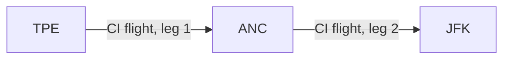
One flight number, one carrier, intermediate stop. **Model: 1 MAWB-arc, 1 MAWB** —
the two legs are flight metadata beneath the arc.

**A3 — Same-carrier connection (two flights).**
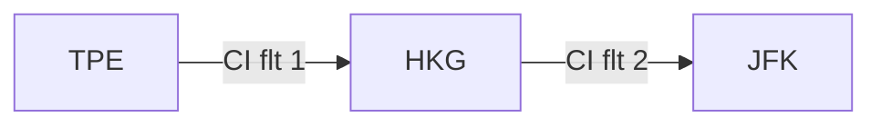
Two CI flights via CI's hub; the carrier issues one AWB TPE–JFK. **Model: 1 MAWB-arc
(TPE→JFK), 1 MAWB** — both flights are metadata beneath it.

**A4a — Interline through-MAWB, same alliance.**

KE + DL (SkyTeam Cargo) under an interline / Cargo SPA — one issuing carrier's AWB.
**Model: 1 MAWB-arc, 1 MAWB.**

**A4b — Interline through-MAWB, bilateral (no alliance).**

CI + CV under a bilateral SPA. **Model: 1 MAWB-arc, 1 MAWB.** Interline needs an
agreement, not an alliance.

### Group B — the journey is a sequence of MAWBs

**B1 — Two carriers, separate contracts → 2 arcs, 2 MAWBs.**
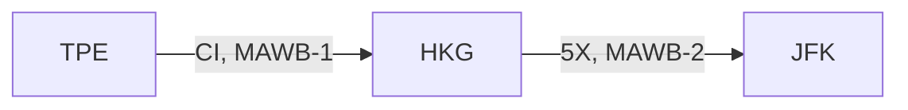
No interline used; re-tendered at HKG.

**B2 — BSA stitched across two carriers → 2 arcs, 2 MAWBs.**
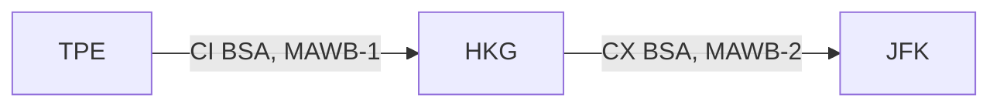
Two per-carrier BSA contracts. Interline one-AWB does not apply to stitched BSAs —
alliance membership does not change this.

**B3 — Consolidate → hub → deconsolidate → re-forward → 3 arcs, 2 MAWBs.**
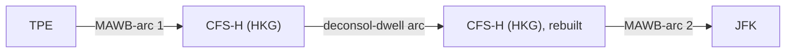
**Model: 3 arcs** — MAWB-arc 1 (TPE→HKG), a **deconsolidation-dwell arc** at the hub
CFS carrying the break/rebuild + delay time, MAWB-arc 2 (HKG→JFK) — **2 MAWBs**.

**B4 — Offer change on the same carrier → 2 arcs, 2 MAWBs.**
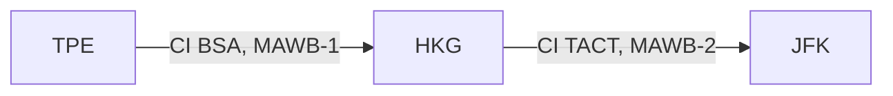
Same carrier, but the contract changes — MAWB boundary is an **offer** boundary.

### Group C — multiple HAWBs / consolidation

**C1 — Basic consolidation → 1 arc, 1 MAWB, all HAWBs on it.**
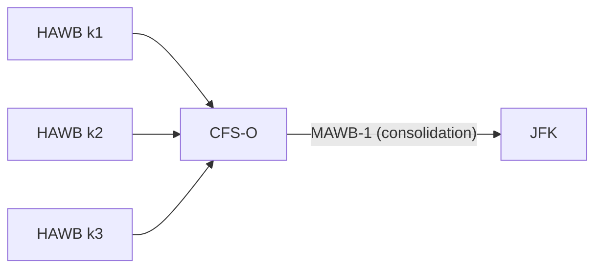
3 HAWBs (same group) consolidate onto one MAWB; rate on the combined chargeable weight.

**C2 — Shared leg, then diverging shipments → 5 O-D arcs.**
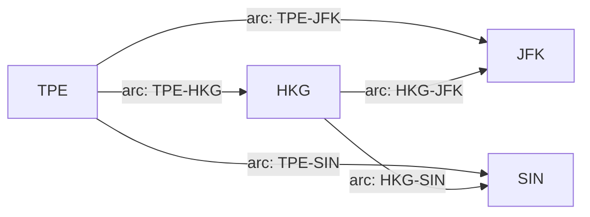
k1 (TPE→JFK), k2 (TPE→SIN). **Model: 5 O-D arcs, each with 1 MAWB** —
`TPE→JFK, TPE→SIN, TPE→HKG, HKG→JFK, HKG→SIN`. Both sub-cases fall out: pick the
through arcs (C2b, independent through-MAWBs) or `TPE→HKG` + onward (C2a,
consolidate-to-hub-then-split). The optimizer chooses. *(Confirm: one of the
originally-listed "TPE→HKG" is read as "TPE→JFK".)*

**C3 — Incompatible cargo → 2 MAWBs on the same arc.**
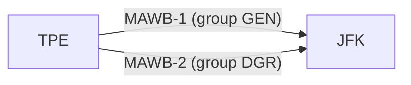
k1 (`GEN`) and k2 (`DGR`) on the same MAWB-arc, **2 MAWBs** — split because
`g(k1) ≠ g(k2)`.

**C4 — Singleton MAWB.**

`VAL` → `g` includes the HAWB id → its own singleton group → 1 dedicated MAWB.

**C5 — Co-load → 1 co-load arc, NO MAWB.**

The forwarder buys space from a co-loader per kg; the co-loader handles
consolidation. **Model: 1 co-load arc, no MAWB object, no group, no CW aggregation.**

**C6 — Re-consolidation at a hub → 2 arcs, 2 MAWBs.**
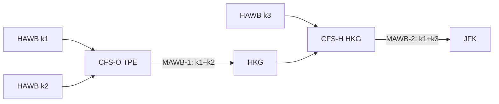
MAWB membership changes leg to leg — k1's MAWB-mates differ on MAWB-1 vs MAWB-2.

**C7 — Consolidation partially diverging at a hub (multi-MAWB × multi-HAWB) → 4 arcs, 3 MAWBs.**
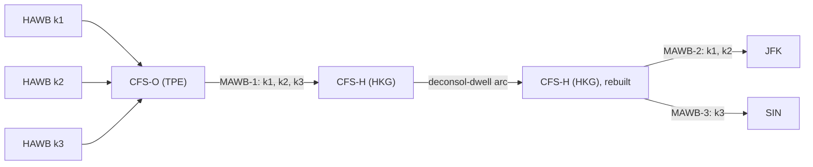
Three HAWBs consolidate onto MAWB-1 (TPE→HKG). At the HKG hub CFS the consolidation
is broken; **k1 and k2 continue together** onto MAWB-2 (HKG→JFK) while **k3 diverges**
onto MAWB-3 (HKG→SIN). **Model: 4 arcs** — MAWB-1, the deconsolidation-dwell arc,
MAWB-2, MAWB-3 — **3 MAWBs**. This is the explicit multi-MAWB × multi-HAWB case:
MAWB-1's HAWB set `{k1,k2,k3}` ⊃ MAWB-2's `{k1,k2}` — a subset relationship *across
arcs*, which is normal and correct (§4.3 — the partition rule governs group
*definitions*, not MAWB-membership sets along a journey). Possible only at a hub with
a `CFS-H` (a forwarder-operated warehouse).

---

## 7. Resolved decisions (Session 14)

- **DGR** → one coarse `DGR` consolidation group (pairwise DG segregation deferred).
- **`g` attributes** → cargo_class + screening_status + temperature_regime.
- **Grouping** → a partition (pairwise disjoint), guaranteed by `g` being an
  attribute-tuple function (see §4.3).
- **C2 sub-cases** → both supported by the 5-arc structure.
- **Partial-overlap consolidation** (k1 `O→X→D`, k2 `O→X→E`) → modeled like C2:
  5 O-D arcs — `O→X, X→D, X→E, O→D, O→E`.
- **Co-load (C5)** → kept (not deferred); a co-load arc, per-kg, no MAWB.
- **`CFS-H`** → exists **only at hubs where the forwarder (or its agent) operates a
  warehouse** — a data input. Deconsolidation / re-consolidation (B3, C6, C7) is
  possible only at those hubs; all other hubs allow carrier-side connections only
  (cargo stays within one MAWB through the connection).
- **Multi-MAWB × multi-HAWB** → walked explicitly as case **C7**.
- **`CFS-O`/`CFS-D`/`CFS-H` off-airport vs on-airport** → modelled identically; the cartage-arc time/cost (origin cartage `CFS-O → POL`, destination cartage `POD → CFS-D`) is near-zero on-airport, real off-airport.
- **CFS↔airport cartage** → explicit arc types added (§3): origin cartage `CFS-O → POL` and destination cartage `POD → CFS-D`.
- **Customs clearance** → explicit per-HAWB dwell arc between `CFS-D` and final delivery (`δ_cust_k`). Not per-MAWB / not per-group; export side folds into the POL cutoff; probabilistic exam-hold remains deferred (§8).
- **Two-phase graph construction** (§5): Phase 1 = physical graph, Phase 2 = MAWB consolidation overlay. Each independently validatable.

---

## 8. Deferred (P1)

**Split shipment** — one HAWB carried across two flights/MAWBs. **Reason: capacity /
partial-roll** (no single flight or MAWB has room for the whole shipment, or part
rolls to a later flight) — *not* grouping. Grouping (DG vs non-DG) keeps the HAWB
whole and routes it to a different MAWB via `g`; it never splits a HAWB. Modeling
options, all deferred:
1. **Virtual sub-HAWBs at intake** — split into 2 HAWBs before the MILP; each routes
   independently; a parent-HAWB link reconciles billing. MILP unchanged. *(Preferred.)*
2. **Native split in the MILP** — allow a HAWB's flow to split across arcs (fractional
   / multi-path flow). Changes flow conservation; heavier.
3. **Post-optimization repair** — solve whole, split in a repair pass if a HAWB
   does not fit.
MVP: **no split** — a HAWB routes whole; if it fits no single MAWB it is reported as a
structured rescue event. Split is P1; option 1 is the likely path.

Other deferred: fine-grained pairwise DG segregation (ULD layer); temperature-band
refinement within `PER`; `COLOADER`-issues-the-MAWB modeling beyond the per-kg arc.

---

## 9. Still open — for user validation

All design questions raised through Session 14 are resolved (§7). Next step is the
**revised air-model formulation spec** built on this graph-construction logic.

The drawio reference for this design is **`docs/air_graph_construction.drawio`**
(new file — direct journey + hub variant + legend). The two older air drawio files
(`docs/air_freight_shipment_subgraph.drawio`, `docs/air_freight_multi_shipment_graph.drawio`)
reflect the now-superseded per-leg structure and should be considered stale — flag
for cleanup or update when convenient.

---

## 10. Fallback arc — feasibility guarantee

Every HAWB gets one extra arc, the **fallback arc**, emitted by the graph generator
in Phase 1 step 12. Its sole purpose is to guarantee MILP feasibility: the optimizer
can never return `INFEASIBLE`, regardless of supply shortfalls, pre-filter outcomes,
or pathological input.

**Definition.**

```
a_fb_k = (O_k, D_k^node)                # direct origin → destination
arc_type = fallback
```

**Per-arc scalars.**

| Field | Value | Notes |
|---|---|---|
| `arrival_time(k, a_fb_k)` | `T_k^abs` | The HAWB's latest valid arrival time. Mandatory-finite for every HAWB. For PER: cargo death point (spoilage, expiration). For GEN: customer-cancellation point (commercial value lost; shipper refunds). Ingestion applies a tenant default (e.g. `cargo-ready + 30 d`) if shipper does not specify. |
| `transit(k, a_fb_k)` | `T_k^abs - t_k^rdy,early` | Modeled in C.6 by setting transit on the fallback arc to this value, so propagation through the arc lands arrival at `T_k^abs` exactly. |
| `cost(a_fb_k)` | `C^fallback` (tenant-global constant) | Recommended default $1,000,000. Must dominate any plausible real routing cost so MILP only selects fallback when no real route exists. |

**Exemptions (the fallback arc bypasses).**

- All 8 pre-filter predicates (`cargo_type_ok`, embargo, lithium, screening,
  `mode_ok`, `carrier_ok`, `ac_type_ok`, latest-valid-arrival reachability,
  per-HAWB ULD physical fit).
- Per-contract allotment (C.5), per-ULD physical capacity (C.5b), per-offer cap (C.5c)
  — fallback carries no MAWB and consumes no capacity.
- Cargo cutoff (C.9).
- MAWB instantiation linkage (C.2) — no `z` variable, no `CW` aggregation.
- Chargeable-weight aggregation (C.4) and all bucket cost terms in the objective.

**What the fallback arc participates in.**

- C.1 flow conservation — like any other arc.
- C.6 time propagation — using the special `transit(k, a_fb_k) = T_k^abs - t_k^rdy,early`.
- C.10 quadratic tardiness — fallback fires `τ_k = T_k^abs - Δ_k`, contributing
  a finite quadratic penalty `W_k * (T_k^abs - Δ_k)^2` on top of `C^fallback`.

**Operational interpretation (cargo class–dependent).**

- **PER, AVI, HUM, VAL.** Fallback selection signals the HAWB is unplannable
  given the current supply set; human intervention is required (e.g. procure
  additional capacity, adjust cargo-ready window with shipper, escalate to a
  co-loader, invoke a spot booking outside the catalog). Cargo would not in
  fact be carried via the fallback; the arc is a planning artifact flagging
  the rescue case.
- **GEN.** `T_k^abs` is the customer-cancellation point. Same operational
  semantics: fallback selection is a rescue-event signal, not an actual
  route.

**Pre-solve warnings.** If the real-arc set surviving the pre-filter is empty
(`A_k \ {a_fb_k} = ∅`), the graph generator logs a structured warning ("HAWB k:
zero real arcs survived pre-filter; will route via fallback"). The MILP confirms
post-solve by selecting `x_{k, a_fb_k} = 1`.

**Post-solve handling.** The orchestrator inspects the fallback set
`K^fb = {k : x_{k, a_fb_k} = 1}` and routes each HAWB through structured rescue
handling (see `model/air_freight_routing.tex §Output and Diagnostics`).

**Why this replaces the prior hard backstop.** Prior to v3-rev-fallback, the
MILP had `C.11: t_k^D ≤ T_k^abs` as a hard constraint. Any disruption (capacity
shortfall, tight pre-filter, rule-engine glitch) could make the MILP infeasible
— operationally disastrous, because the operator gets no plan at all. The
fallback arc converts feasibility into an objective-value signal: the MILP
always returns *some* plan, and fallback-arc usage is the structured indicator
of where intervention is needed. This is the standard artificial-arc / slack-arc
pattern in MILP feasibility-recovery.
