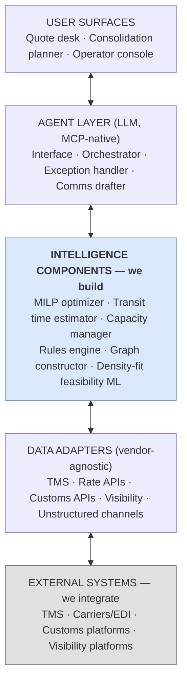

# System Architecture

How the components of the AI freight agent fit together. Companion to `PRD.md` (what we're building) and `build_plan.md` (when we're building it).

This is a living document — major updates land at the end of each architectural-decision session. See `OPEN_DECISIONS.md` for in-flight changes.

---

## 1. One-paragraph summary

A multimodal freight routing system where deterministic components (MILP optimizer, ML transit-time model, rules engine, rate APIs) do the routing math, and an LLM agent layer provides the interface, exception handling, and pattern detection that makes the system usable at scale. Plans are continuously generated as soft proposals; flags surface anomalies for operator review; commits happen at scheduled moments per shipment. Operators retain control; the agent reduces the friction of using control.

---

## 2. Core principle: plan-goodness, not confidence

We do not score "confidence" in a routing recommendation. We evaluate **plan goodness** on two orthogonal dimensions:

- **SLA satisfaction** — does $P(\text{on-time}) \geq$ the service-tier threshold? (Express ≥ 0.95, Standard ≥ 0.90, Economy ≥ 0.80)
- **Cost reasonableness** — is the cost within an expected band? (Outlier if > $N \times$ lane-median)

These produce **flags**, not scalar scores. Flags are orthogonal: a shipment can carry zero, one, or several. Each has its own resolution path.

See memory record `project_plan_goodness_reframe.md` for the rationale.

---

## 3. The lifecycle

```
┌─────────────────────────────────────────────────────────────────────┐
│  Shipment arrives                                                   │
│      ↓                                                              │
│  ┌──────────────────────────────────────────────────────────┐       │
│  │ SOFT PLANNING PHASE                                       │       │
│  │ ─────────────────                                         │       │
│  │ • MILP solve produces candidate plan                      │       │
│  │ • Plan published to operators (visible, reviewable)       │       │
│  │ • Flags generated and surfaced to operator inbox          │       │
│  │ • Re-plan triggers fire continuously (events listed below)│       │
│  │ • Plan and flags update with each re-solve                │       │
│  │ • Operators can: review, override, request alternatives,  │       │
│  │   accept risk, force-commit early                         │       │
│  └──────────────────────────────────────────────────────────┘       │
│      ↓ (at scheduled commit moment OR operator force-commit)        │
│  ┌──────────────────────────────────────────────────────────┐       │
│  │ COMMIT PHASE                                              │       │
│  │ ─────────────                                             │       │
│  │ • Query live rates via carrier APIs (where available)     │       │
│  │ • Rate-surprise check: live vs. planned within tolerance? │       │
│  │ • If clean and no unresolved flags → BOOK                 │       │
│  │ • If rate surprise → enqueue for batch re-solve, no book  │       │
│  │ • If unresolved flag → escalate                           │       │
│  └──────────────────────────────────────────────────────────┘       │
└─────────────────────────────────────────────────────────────────────┘
```

**Plans are soft until commit.** Between the moment a plan is generated and the moment it commits, anything can change: the plan re-solves on new data, operators can modify or override, flags can appear and clear. The commit moment is the only point where action becomes irreversible (we book with a carrier).

**The commit phase has no auto-execute cell.** Every commit goes through the same gate: are flags resolved (or risk-accepted)? Auto-execute means "auto-attempt-the-commit" — it does not bypass flag handling.

---

## 4. Flag taxonomy

Five flag types, orthogonal:

| Flag | Generated by | Resolution path |
|---|---|---|
| **SLA risk** | $P(\text{on-time}) <$ tier threshold | Re-plan (try premium route); or operator accepts the risk |
| **Cost outlier** | $\text{cost}(k) > N \times$ lane median | Human picks up phone; finds alt rate; rate catalog gets updated |
| **Rate surprise** | Live API rate > X% above planned rate | Batch re-solve; or operator approval to book at surprise rate |
| **Capacity risk** | Allocation utilization tight; risk of being squeezed out | Re-plan if alternative exists; book early to lock |
| **Disruption** | Event-driven (port closure, weather, strike) | Re-plan affected shipments |

Each flag is logged with its trigger, threshold breached, resolution action, and timestamp. The override log carries structured reason codes (see §7).

---

## 5. Re-plan triggers

Continuous re-planning is the steady state. Two trigger categories:

**Event-driven:**
1. New shipment added to the batch
2. Rate catalog refresh (or live API delta noticed at sample time)
3. Schedule update (flight slip, cancel, new flight added)
4. Capacity update (allocation consumed elsewhere, or new allocation arrived)
5. Disruption alert (operations feed)
6. Operator override (forces a re-solve from the changed constraint)
7. Carrier-policy change (allow/deny list update from rules engine)
8. Rate-surprise batch reaches threshold (X shipments queued for re-solve)

**Time-driven (belt-and-suspenders):**
- Periodic refresh — every N hours, re-solve to incorporate accumulated drift
- Pre-commit refresh — at $\text{cutoff} - 2 \times \text{safety\_margin}$, force re-solve before the human-review window opens
- Commit window — at $\text{cutoff} - \text{safety\_margin}$, commit machinery activates

---

## 6. Commit-window policy

Default: $\text{commit\_offset}(k) = \text{cutoff}(k) - \text{tier\_safety\_margin}(\text{sp}(k))$

Initial tier-safety-margin defaults (tunable per tenant):

| Service tier | Safety margin | Rationale |
|---|---|---|
| Express | 6 h | Lock capacity early; capacity > cost optimization |
| Standard | 12 h | Balance |
| Economy | 24 h | Let rates stabilize; more time for re-planning |

Variables that shift the default:

- **Capacity-constrained lane** → commit earlier
- **Spot-rate dominant lane** → commit later (within MVP, no arbitrage)
- **Carrier already locked / allocation contracted** → commit anytime
- **Cutoff distance** → if cutoff hours away, commit now; if days away, more time

Operators can always force-commit earlier; the system will not commit later than the calculated commit moment.

---

## 7. Components

### 7.1 Deterministic core (the routing brain)

| Component | Responsibility | Implementation |
|---|---|---|
| **Graph generator** | Build per-shipment subgraph $A_k$ from supply catalog, schedules, allocations, rules. Per-arc scalars ($\mu_a$, $\text{CO}_a^*$) precomputed. | Python; consumes catalog + per-shipment attrs |
| **MILP optimizer** | Solve the consolidation + routing problem over $K$ for the current batch. Produce $x_{k,a}$, $z_{a,g}$, $\text{CW}_{a,g}$, etc. | HiGHS via `highspy` |
| **Transit-time model** | Output $P(\text{on-time})$ distribution per arc / per route for the SLA risk flag | ML model (Phase 4+); deterministic baseline (Phase 1) |
| **Rules engine** | Carrier allow/deny resolution; service-product enforcement; embargo / lithium / DGR predicates | Layered policy cascade (see `agent_design.md`) |
| **Rate catalog** | Source-of-truth for rates: contract / live spot / snapshot / TACT / prediction (5-tier; see §8) | Postgres / Redis hot cache |

These components return deterministic outputs given inputs. They do not "reason." They are the math.

### 7.2 The LLM agent layer (the interface)

The agent does not route. It makes the routing system usable.

**MVP capability set — four roles** (refined 2026-05-25 after the forwarder-ops analysis; see `docs/forwarder-operations-analysis/00-synthesis.md` for the derivation):

1. **Input parsing** — extract structured shipments from unstructured channels. Email side via integration (Sedna / Wisor / Shipamax / cargo.one Oct 2025 — commoditized vendor space). **The project's own wedge here is the WhatsApp / voice / partner-message channel**, which Agent 4's analysis identifies as the least-crowded AI surface in the market.
2. **Ad-hoc query** — "Why CX over BR?" "What's the plan for shipment X?" Most queries reduce to (a) TMS lookup (Bucket B), (b) MILP-output explanation (Bucket C composing with D).
3. **Materiality / re-plan-trigger assessment** — does a state change invalidate the committed plan for this shipment, given customer SLA + downstream commitments + cost context? No incumbent platform owns this layer because none owns the full customer context (visibility platforms predict ETAs; intel platforms detect events; nobody connects them to materiality). Load-bearing for the disruption-handling loop.
4. **Re-plan trade-off explanation** — converts MILP output into operator-readable options ("re-tender to KE, +$240, ETA holds vs hold and wait, save $240, breach Standard SLA tier"). The bridge between MILP and operator trust.

**Rejected from MVP scope** (each is a UI feature in disguise OR a commoditized capability OR a risky LLM application — full rationale in synthesis §5):

- Exception triage as an LLM task — dashboard + sort/filter handles 80%
- Customer-facing autonomous comms drafting — keep human in the loop for v1; auto-send threshold-gated by override rate
- Override-log pattern detection — SQL + weekly digest, not LLM
- Request decomposition — UI buttons with parameterized MILP variants

What the agent **never** does: the MILP itself, transit-time prediction, rate calculation, rules validation, routine re-solves, autonomous carrier API booking. Those are deterministic.

See memory record `project_agent_role_taxonomy.md` (the original 2-capability scope), which this section supersedes with the refined 4-capability list.

### 7.3 Operator interface

- **Plan inbox** — current candidate plans + flag status per shipment
- **Flag triage** — per-flag resolution actions (re-plan, accept risk, escalate, override)
- **Conversational queryable agent** — ask questions about any plan or decision
- **Override capture** — every override carries a structured reason code (see §9)

### 7.4 Execution / commit machinery

- Watches commit clocks per shipment
- At commit moment, queries live carrier rates, runs rate-surprise check
- Books via carrier APIs (WebCargo / cargo.one / CargoAi / direct integrations)
- Logs commit outcome; logs rate-surprise events

---

## 8. Rate sourcing (5-tier strategy)

Each rate carries `source` and `freshness_timestamp` metadata. MVP-implementable tiers:

1. **Contract rates (BSA / NAC)** — internal catalog, refreshed on contract update. No API.
2. **Live spot rates** — aggregator API (WebCargo as default; ~70 live carriers) + direct integrations to top 5–10 carriers.
3. **Snapshot spot rates** — cached recent quotes with freshness TTL (24h stable lanes, 4h volatile).
4. **TACT baseline** — IATA TACT Online subscription for unmapped lanes.
5. **Prediction model** — deferred; only if MVP customer demand calls for it.

See memory `reference_rate_api_landscape_2026.md` for the full landscape.

---

## 9. Override log and feedback loop

Every operator override is logged with:

```json
{
  "timestamp": "...",
  "shipment_id": "...",
  "plan_id": "...",
  "agent_recommendation": {...},
  "operator_decision": {...},
  "reason_code": "data-stale | constraint-missing | wrong-carrier | wrong-route | transit-time-off | operator-preference-not-modeled | rate-outdated | other",
  "reason_text": "free-text"
}
```

This log is the primary input to:

- Trust degradation triggers (per memory `project_override_rate_kpi.md`)
- Rate-catalog updates (root cause = `rate-outdated`)
- Rules-engine updates (root cause = `operator-preference-not-modeled`)
- ML model retraining feedback (root cause = `transit-time-off`)
- Pattern detection by the agent (clusters of similar reasons)

**Override rate is the central operational KPI**, not model accuracy. Target band 5–8% for MVP-graduated customers.

---

## 10. Deployment ladder per customer

Per the 95% accuracy trap principle (see memory `project_override_rate_kpi.md`):

| Mode | Duration before promotion | Override-rate gate |
|---|---|---|
| Co-pilot (human approves every decision) | ≥4 weeks | — |
| Supervised (matrix applies; human reviews flagged) | ≥8 weeks | <8% override on Tier-1-equivalents |
| Autonomous per-lane (commits flag-clear plans at commit moment) | activate per lane after sustained low override | sustained <8% on that lane |

Don't compress the ladder. The long tail of edge cases only surfaces with calendar time and operator variation.

---

## 11. System diagram — five-layer stack

The companion `docs/architecture.drawio` is the visual source of truth. The structure is a five-layer stack with explicit "we build" / "we integrate" boundaries:



**Per-layer responsibilities:**

- **Layer 1 — User surfaces.** Two MVP prongs (quote desk, consolidation planner) plus an operator console for replan / exception handling. See memory `project_two_pronged_wedge.md` for ordering rationale and why drayage / KAM / CFS supervisor are not primary surfaces.
- **Layer 2 — Agent layer.** The LLM agent's four MVP capabilities (see §7.2). MCP-native so external agents can compose. Absorbs reactive interrupt load so the operator can hold focus for planning work.
- **Layer 3 — Intelligence components (we build).** Six deterministic components: MILP optimizer (cost-to-serve quote, consolidation P1–P5, drayage VRPTW), transit time estimator (ETA distribution + P(customs hold) feature), capacity manager (BSA / NAC budgeting), rules engine, graph constructor (DG / temp / screening as arc constraints), density-fit feasibility ML — see memory `project_density_fit_architecture.md` for the assignment + ML-feasibility design.
- **Layer 4 — Data adapters.** Vendor-agnostic interfaces. No component depends on a specific vendor's schema. Unstructured channels (email, WhatsApp, voice) live here alongside structured adapters; the agent layer parses upward.
- **Layer 5 — External systems (we integrate).** TMS, carriers, customs platforms, visibility platforms. The "above-TMS" positioning is enforced visually — TMS sits below the intelligence layer, not at the same level. See memory `project_intelligence_layer_positioning.md`.

---

## 12. What this architecture is NOT

To be explicit about scope and avoid drift:

- **Not an LLM-routed system.** The LLM does not pick routes.
- **Not a single-solver black box.** Operators see plans, see flags, can override at any time.
- **Not real-time / streaming.** Re-plans are batch-cadence, event-triggered.
- **Not arbitrage-aware (MVP).** Future spot-rate prediction is deferred.
- **Not multi-forwarder.** Single-tenant solve; multi-tenant platform.
- **Not a quote-desk vendor.** Email parsing + quote turnaround is commoditized (Sedna, Wisor, Shipamax, Expedock, cargo.one Oct 2025 release). The optimizer's pitch is mode-choice and consolidation, not 30-second quote response.
- **Not a document-AI vendor.** Commercial invoice / packing list / B/L parsing is commoditized (Expedock, Vector.ai, ABBYY, Affinda, Hyperscience). Integrate, don't build.
- **Not an HS-classification vendor.** Avalara / Zonos / 3CE / iCustoms / Squadra / Digicust cover this with 85–95% accuracy claims. Integrate, don't build.
- **Not a sanctions-screening vendor.** Sayari / Kharon / Visual Compliance / Refinitiv / Dow Jones own this. Integrate.
- **Not a SAP TM / SAP HANA integration target.** Mid-size segment runs CargoWise (dominant), Riege, Magaya, GoFreight. SAP TM is a Tier-1 / shipper-side concern; DSV's 2019 migration off SAP TM after Panalpina is the supporting evidence.

---

## 13. Open decisions feeding this doc

See `OPEN_DECISIONS.md` for the live catalog. Notable items affecting architecture:

- Override-rate degradation threshold (5% / 8% / 10%?)
- MVP rate aggregator pick (WebCargo recommended)
- Commit-window safety-margin defaults
- Cost-outlier multiplier $N$

---

## 14. References

- Memory: `project_plan_goodness_reframe.md`, `project_agent_role_taxonomy.md`, `project_override_rate_kpi.md`, `reference_rate_api_landscape_2026.md`, `project_air_screening_decision.md`, `project_workflow_vs_ai_buckets.md` (new — see §15)
- Docs: `PRD.md`, `agent_design.md` (currently being restructured), `build_plan.md`, `data_model.md`, `model/air_freight_routing.tex`, `docs/forwarder-operations-analysis/00-synthesis.md` (new — see §15)
- External: Felix Cheng, "The 95% Accuracy Trap" (LinkedIn, May 2026)

---

## 15. Workflow vs AI vs MILP — the operational taxonomy

The 4-bucket framework from `docs/forwarder-operations-analysis/00-synthesis.md` (derived from a 27,000-word cross-domain analysis of mid-size forwarder operations across four domains — front office, network ops, compliance/customs, exceptions/re-planning):

| Bucket | Inputs | Decision | Volume | Project posture |
|---|---|---|---|---|
| **A. Pure workflow** | Structured (EDI / API / portal) | Deterministic | High | Integrate with TMS / EDI / aggregator |
| **B. Hybrid: AI parse → workflow execute** | Unstructured (email, doc, image) | Deterministic once parsed | High | Integrate vendor (Sedna / Wisor / Expedock); build only WhatsApp/voice gap |
| **C. AI agent for low-volume novel reasoning** | Mixed | Judgment | Low (rare per shipment) | **Build.** Project's distinctive capability. |
| **D. Deterministic optimization (MILP / VRP / ML)** | Structured | Multi-constraint cost trade-off | Per-build / per-disruption | **Build.** Project's core wedge. |

The disruption-handling loop composes Buckets B, C, D and is the project's load-bearing architectural payoff. Sequence: structured signals → workflow ingests; templated emails → hybrid AI parses; unstructured channels (WhatsApp, voice, free-text) → AI agent infers event class + materiality; MILP re-solves over affected subgraph; AI explains options; human commits; workflow executes. See synthesis §7 for the full diagram.

The four agent docs in `docs/forwarder-operations-analysis/` are the receipts. The synthesis doc is the executive view. This section is the architectural bookmark.
