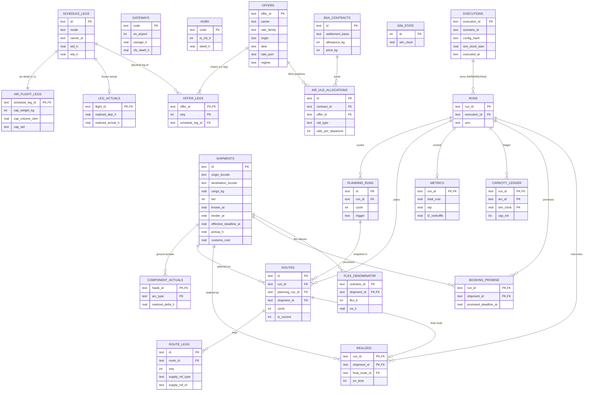

# Scenario DB — entity-relationship diagram

Mirrors the `SCHEMA` string in `src/scenario_db.py` (the single SQLite↔Postgres seam) as of
Session 31. Three layers: **input** (pre-generated, read-only at replay), **frozen
realizations** (one draw each, shared by all arms), **output** (written by the replay loop,
keyed by run). Attribute lists show PKs/FKs + a few representative columns, not every column —
read the DDL for the full set.

## Notes / things the diagram can't show

- **No-FK logical links (intentional).** `GATEWAYS.code` / `HUBS.code` are referenced by
  `SHIPMENTS.origin_locode`/`destination_locode` and `OFFERS.origin`/`dest` **by value, with no
  FK** — gateway/hub configs are scenario-global lookups, not owned by a parent row. Same for
  `carrier_id`/`tenant_id` (plain provenance TEXT, no FK in the single-tenant sim). So GATEWAYS
  and HUBS render as standalone boxes; that's correct.
- **`ROUTE_LEGS.supply_ref` is polymorphic** (`supply_ref_type` + `supply_ref_id`): it points at
  a `schedule_leg` (and in the sim, only that), so no FK — a type-tagged soft reference.
- **`SIM_STATE` is a single pinned row** (`CHECK (id = 1)`); the `visible_shipments` view joins
  it against `SHIPMENTS.known_at` to do clock-gated reveal. The view isn't an entity, so it's
  not in the diagram.
- **`FLEX_DENOMINATOR` is scenario-scoped, not run-scoped** (PK `scenario_id, shipment_id`) — the
  D-F7 arm-invariance requirement. It's the one output-ish table that deliberately does *not*
  hang off `RUNS`.
- **`EXECUTIONS → RUNS`** is the Session-31 normalization: per-execution provenance
  (`scenario_id`/`config_hash`/`sim_clock_start`/`executed_at`) lives once on `EXECUTIONS`; `RUNS`
  is just `(run_id, execution_id, arm)` with `UNIQUE(execution_id, arm)`.
- **Capacity columns are INTEGER** so `CHECK (cap_init = tendered + committed_untendered + free)`
  on `CAPACITY_LEDGER` is exact integer arithmetic.
